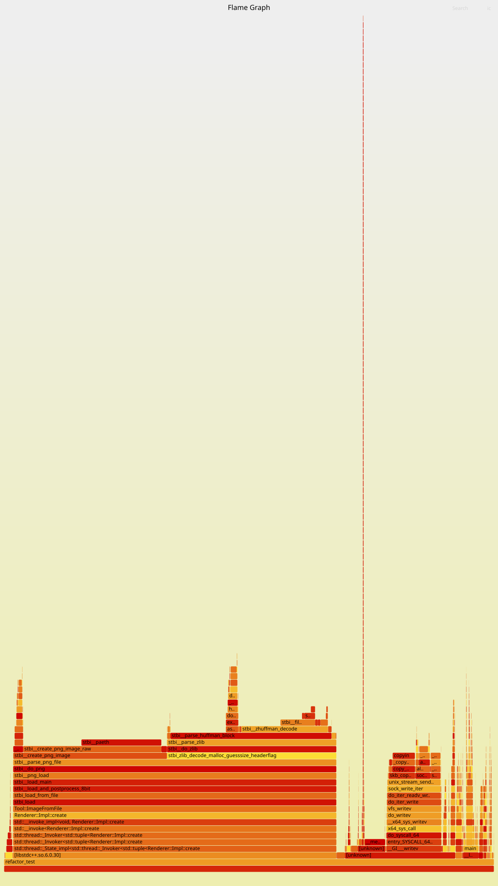
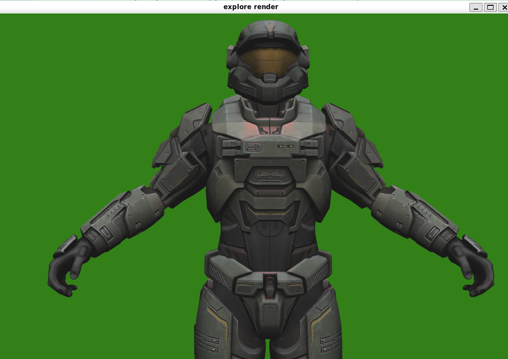
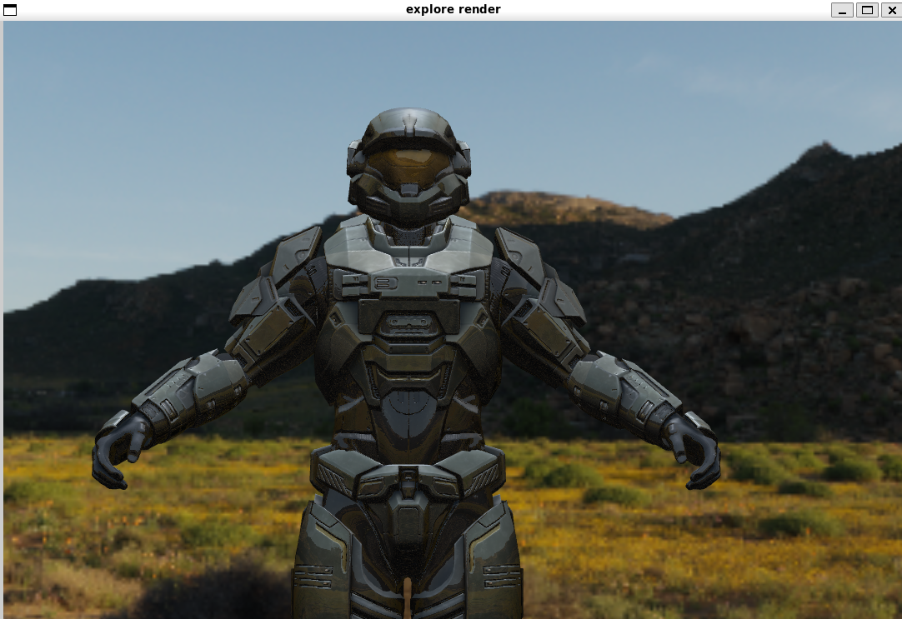
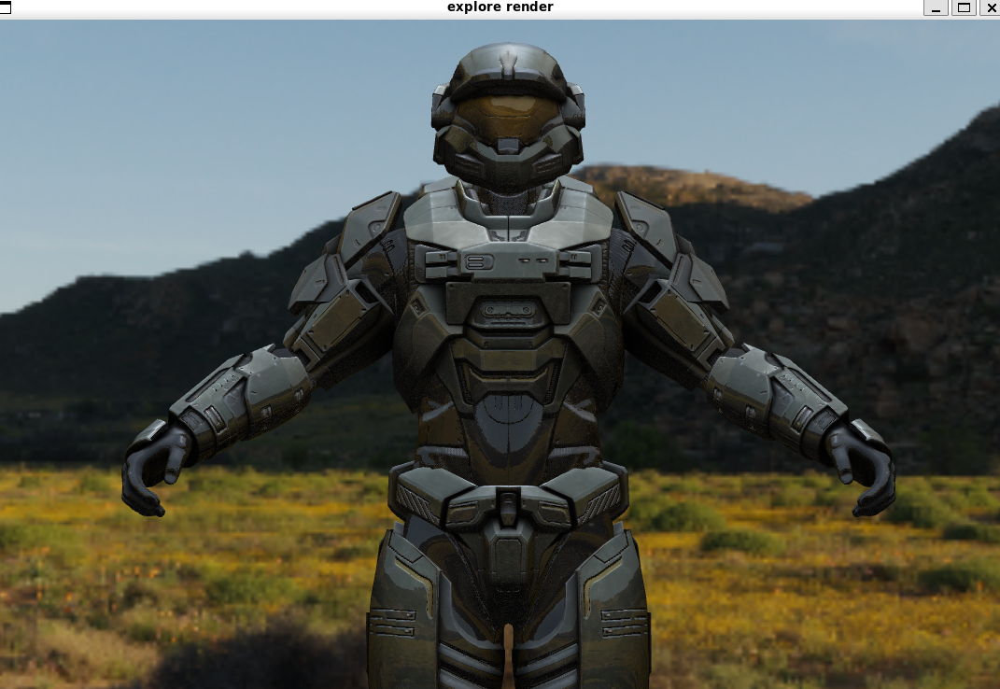
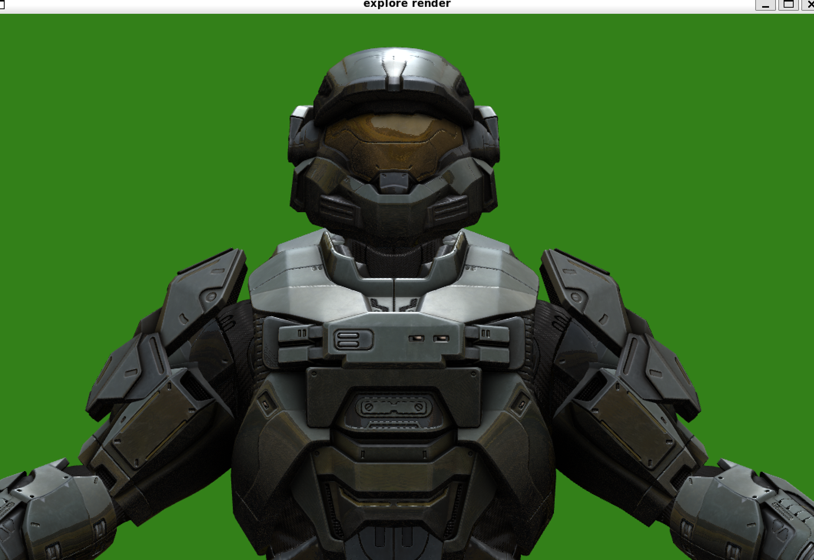
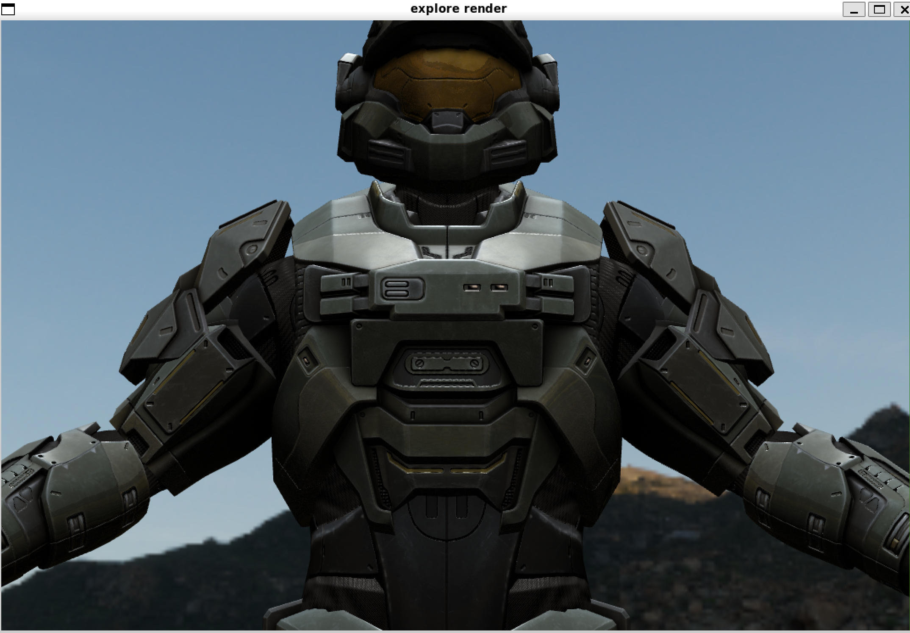
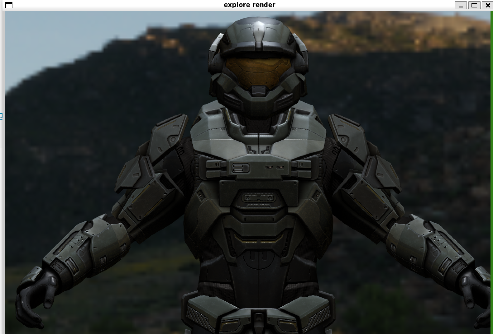
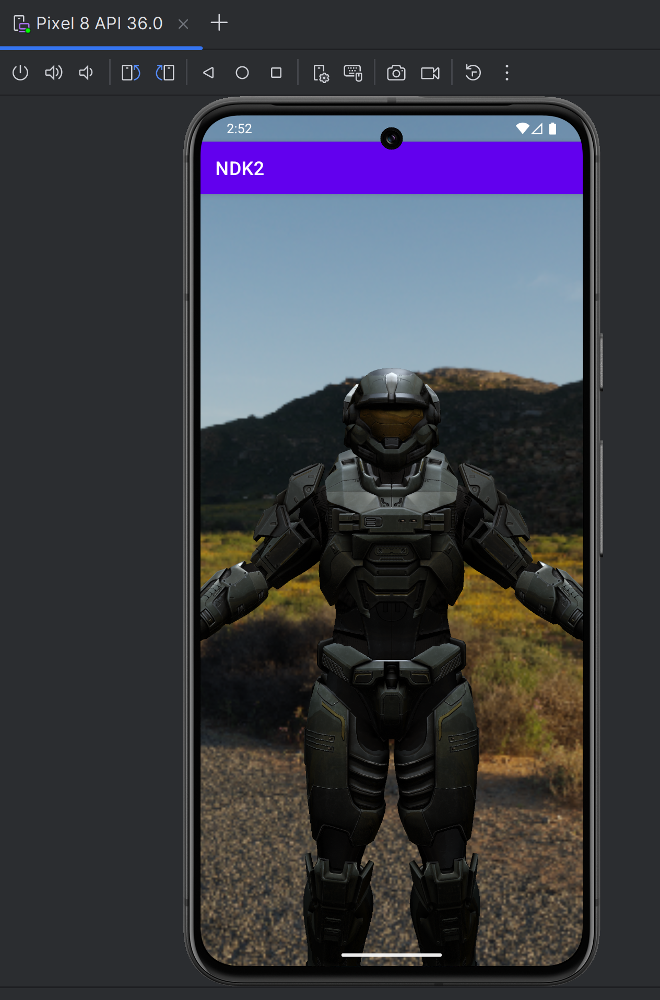

# render_explore_by_opengl
render_explore_by_opengl

# TODO:
1. 在着色器中区分纹理是单通道还是多通道, 对于ao，specular，Metallic, Roughness 这些贴图，一般是单通道的
2. 3D 纹理和 2D 纹理不能混淆
3. 金属度贴图效果可能不明显，只有边缘是金属

# build
```
mkdir build
cd build
cmake ..
make -j6

./src/render_explore_by_opengl
```

# bazel build
```
bazel build //src:refactor_test 

// debug version
bazel build --cxxopt="-g" --strip=never  //src:refactor_test 
```

# NDK build for x86 lib
```
mkdir build
cd build

export ANDROID_NDK=/opt/ndk

cmake -DCMAKE_TOOLCHAIN_FILE=$ANDROID_NDK/build/cmake/android.toolchain.cmake \
    -DANDROID_ABI=x86_64 \
    -DANDROID_PLATFORM=android-29 \
    ..

make -j$(nproc)

# strip debug info
$ANDROID_NDK/toolchains/llvm/prebuilt/linux-x86_64/bin/llvm-strip --strip-unneeded src/librender_explore_by_opengl.so
```

# perf profiling
./perf.sh bazel-bin/src/refactor_test


# todos
[todo](TODO.md)

# questions
1. AO 贴图用于中间阶段还是应用于最后的结果中
2. skybox 作为环境光的时候应该与漫反射颜色相乘还是相加。-- 相乘作为环境光颜色看起来更好一些。

# result
## phong model effect
### diffuse + specular + normal + ao textures 


### diffuse + specular + normal + ao textures + skybox reflection 


### use ao texture to the final result


### use ao texture to the final result and add roughness texture


### skybox reflection multiplied with diffuse color


### light attenuation


## android studio

